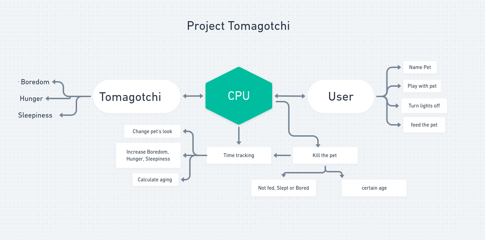

# Project0

MVP:

This game will be a time tracking program which will be aging the character within a 5 minute time frame and user needs to keep it alive by:

1. feeding the pet.
2. letting the pet rest.
3. play with the pet.

User also gets to name their pet.

Extras:
User can set a specific time frame and able to change the default 5 minute.

